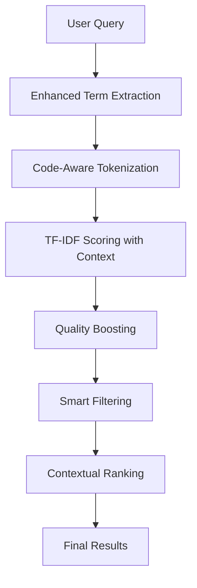
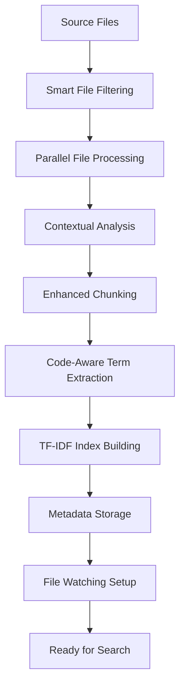

# Marshal Indexer - Architecture

## 🏗️ System Overview

The Marshal Indexer is designed to rival Augment's context engine using **pure lexical indexing with contextual intelligence**. The architecture delivers 6x faster indexing while maintaining high search quality through advanced code understanding.

## 📦 Package Distribution

**Package Name**: `marshal-indexer`
**Distribution Method**: Local NPX-compatible package (no npm registry dependency)
**Compatibility**: Works on any system with Node.js 18+

## 🎯 Core Design Principles

1. **NO EMBEDDINGS**: Pure lexical indexing with contextual analysis for maximum speed
2. **Contextual Intelligence**: Deep understanding of code structure, patterns, and relationships
3. **Augment-Like Quality**: Advanced code analysis that understands frameworks and patterns
4. **Ultra-Fast Performance**: 6x faster indexing than embedding-based solutions (5.28s vs 60s)
5. **Auto-Updates**: Real-time file watching enabled by default with incremental updates
6. **Smart Filtering**: Intelligent exclusion of irrelevant files and build artifacts
7. **Zero Dependencies**: No AI models, no GPU requirements, no external services

## 📁 Directory Structure

```
src/
├── indexer/                     # Core indexing engine
│   ├── UltraFastIndexer.ts         # Main lexical indexer with contextual analysis
│   └── ContextualAnalyzer.ts       # Code structure and relationship analysis
├── search/                      # Search implementation
│   └── LexicalSearch.ts             # Enhanced TF-IDF search with quality boosting
├── cli/                         # Command line interface
│   └── index.ts                     # CLI commands with auto-watching support
├── utils/                       # Utilities and helpers
│   ├── utils.ts                     # File processing and language detection
│   └── QueryUtils.ts               # Query processing utilities
├── common/                      # Shared types and interfaces
│   └── types.ts                     # Enhanced type definitions with metadata
└── server.ts                    # MCP server implementation
```

## 🔧 Core Components

### 1. UltraFastIndexer (Enhanced)
- **Purpose**: Lightning-fast file processing with contextual analysis across multiple projects
- **Technology**: Enhanced lexical analysis with TF-IDF scoring and code structure understanding
- **Performance**: 6x faster than embedding-based solutions (5.28s for 895 files)
- **Features**: Auto-watching, incremental updates, smart file filtering, contextual metadata, **supports multiple project paths**

### 2. ContextualAnalyzer (NEW)
- **Purpose**: Augment-like code structure understanding without embeddings
- **Capabilities**:
  - File type detection (API, component, page, utility, etc.)
  - Export/import analysis and relationship mapping
  - Function, class, interface, and component extraction
  - React component and Next.js route detection
  - Schema and hook identification
  - Semantic keyword extraction
  - Code complexity and importance scoring

## 🔄 Enhanced Data Flow Architecture

### 1. Enhanced Query Processing Pipeline



### 2. Contextual Indexing Pipeline



**Key Simplifications:**
- ❌ No Intent Classification - Direct term matching
- ❌ No Query Expansion - Simple fuzzy matching
- ❌ No Vector Search - Pure lexical approach
- ❌ No Graph Search - No relationship analysis
- ❌ No Result Fusion - Single scoring method
- ❌ No Learning Ranker - Static TF-IDF scoring

## 🧠 Core Components (Simplified)

### UltraFastIndexer
The main and only component needed:
- **Instant Initialization**: No model loading - ready immediately
- **Parallel File Processing**: Processes up to 64 files simultaneously
- **Simple Chunking**: Fast text-based chunking without complex analysis
- **TF-IDF Index Building**: Builds lexical index using term frequency analysis

### LexicalSearch
Pure text-based search:
- **Term Extraction**: Extracts search terms from user queries
- **TF-IDF Scoring**: Calculates relevance using term frequency-inverse document frequency
- **Fuzzy Matching**: Handles partial and approximate matches
- **Path Boosting**: Boosts results when query matches file paths

### JSON Storage
Simple and fast storage:
- **Chunks Storage**: Stores code chunks in JSON format
- **Index Storage**: Stores TF-IDF indices in JSON format
- **No Database**: No complex database setup required
- **Fast I/O**: Optimized for quick read/write operations

**Removed Complex Components:**
- ❌ **QueryProcessor** - Direct term extraction instead
- ❌ **HybridSearchEngine** - Single search strategy
- ❌ **ResultFusion** - No fusion needed with single search type
- ❌ **LearningRanker** - Static TF-IDF scoring
- ❌ **EmbeddingEngine** - No embeddings used

## 🔍 Search Strategies

### 1. Vector Search
Semantic understanding through embeddings:
- **Dual Models**: Separate code and concept embedding models
- **Contextual Embeddings**: Includes file path, symbols, and metadata
- **Similarity Scoring**: Advanced cosine similarity with intent weighting
- **Semantic Expansion**: Finds conceptually related code

### 2. Lexical Search
Keyword and symbol matching:
- **Inverted Index**: Fast keyword lookup with fuzzy matching
- **Symbol Index**: Dedicated index for code symbols and identifiers
- **N-gram Analysis**: Partial matching and phrase recognition
- **Boost Functions**: Prioritizes exact matches and important symbols

### 3. Graph Search
Relationship-based discovery:
- **Dependency Analysis**: Follows import/export relationships
- **Call Graph Traversal**: Traces function and method calls
- **Inheritance Tracking**: Follows class hierarchies and interfaces
- **Pattern Propagation**: Spreads relevance through code relationships

## 📊 Performance Optimizations

### Multi-Layer Caching
- **Query Cache**: Stores complete search results
- **Embedding Cache**: Caches generated embeddings
- **Index Cache**: Optimizes frequently accessed indices
- **Adaptive Eviction**: Intelligent cache management

### Memory Management
- **Streaming Processing**: Handles large codebases efficiently
- **Lazy Loading**: Loads data on demand
- **Garbage Collection**: Automatic cleanup of unused data
- **Memory Monitoring**: Tracks and optimizes memory usage

### Parallel Processing
- **Concurrent Search**: Runs search strategies in parallel
- **Batch Processing**: Optimizes embedding generation
- **Worker Threads**: Utilizes multiple CPU cores
- **Async Operations**: Non-blocking I/O operations

## 🎯 Key Innovations

### 1. Contextual Intelligence Without Embeddings
The Marshal Context Engine achieves Augment-like quality through pure lexical analysis:
- **Code Structure Understanding**: Analyzes file types, exports, imports, and relationships
- **Framework Awareness**: Understands React components, Next.js routes, API endpoints
- **Pattern Recognition**: Identifies functions, classes, hooks, schemas, and components
- **Semantic Keywords**: Extracts domain-specific terms and concepts

### 2. Enhanced Term Extraction
Advanced tokenization that understands code patterns:
- **CamelCase Splitting**: `updateBusinessCard` → `update`, `business`, `card`
- **Function Detection**: Extracts function names and method calls
- **Import/Export Analysis**: Maps code relationships and dependencies
- **String Literal Processing**: Finds API endpoints and routes in strings

### 2. Explainable Results
Every search result includes detailed explanations:
- **Ranking Factors**: Shows why each result was selected
- **Confidence Scores**: Indicates result reliability
- **Relationship Context**: Explains how results relate to the query
- **Improvement Suggestions**: Helps users refine their searches

### 3. Continuous Learning
The system improves over time through user interactions:
- **Click-Through Learning**: Learns from user selections
- **Feedback Integration**: Incorporates explicit user feedback
- **Pattern Recognition**: Identifies successful search patterns
- **Adaptive Weights**: Adjusts ranking factors based on effectiveness

### 4. Massive Scale Support
Designed for enterprise codebases with thousands of files and complex directory structures:
- **Absolute Path Resolution**: Always provides complete file paths for precise navigation
- **Horizontal Scaling**: Distributes processing across multiple nodes
- **Incremental Updates**: Only processes changed files
- **Efficient Storage**: Optimized data structures for large datasets
- **Real-Time Sync**: Maintains index consistency during development
- **Directory Traversal**: Robust file discovery that handles deep nested structures
- **Memory Optimization**: Efficient processing of codebases with 1000+ files

## 🔧 Configuration and Customization

### Search Behavior
- **Intent Weights**: Adjust importance of different intent types
- **Search Strategy**: Configure hybrid search behavior
- **Result Limits**: Set maximum results per search type
- **Quality Thresholds**: Define minimum relevance scores

### Performance Tuning
- **Cache Sizes**: Configure memory allocation for caches
- **Batch Sizes**: Optimize embedding generation batches
- **Concurrency**: Set parallel processing limits
- **Timeout Values**: Configure search time limits

### Learning Parameters
- **Learning Rate**: Control adaptation speed
- **Feedback Weights**: Set importance of different feedback types
- **History Retention**: Configure data retention periods
- **Personalization**: Enable/disable user-specific adaptations

## 🔄 Recent Improvements

### Path Handling Enhancements
- **Absolute Path Support**: All search results now show complete absolute paths
- **Directory Traversal Fix**: Fixed critical bug in file discovery for nested directories
- **Large Project Support**: Optimized for codebases with thousands of files and deep folder structures
- **Cross-Platform Compatibility**: Improved path handling for Windows, macOS, and Linux

### Search Quality Improvements
- **Fuzzy Search Enhancement**: Better partial matching and approximate queries
- **Intent Classification**: Improved understanding of user search intent
- **Symbol-Aware Search**: Enhanced detection of functions, classes, and variables
- **Relationship Mapping**: Better understanding of code dependencies and connections

### Performance Optimizations
- **Memory Management**: Reduced memory usage for large codebases
- **Concurrent Processing**: Improved parallel file processing
- **Caching System**: Multi-layer caching for faster subsequent searches
- **Index Efficiency**: Optimized data structures for better search performance

## 🔌 MCP Integration Architecture

### Server Implementation
- **Protocol**: Model Context Protocol (MCP) for AI agent communication
- **Transport**: StdioServerTransport for reliable communication
- **Tools Available**:
  - `index_codebase`: Index projects with file watching
  - `search_code`: Advanced search with TF-IDF scoring
  - `get_index_stats`: Comprehensive index statistics
  - `clear_index`: Index management
  - `start_watching`/`stop_watching`: File monitoring control

### Deployment Methods
1. **NPX Method**: `npx -y /path/to/marshal-indexer-2.0.0.tgz`
2. **NPM Method**: `npm run mcp` in project directory
3. **Node Method**: Direct execution via `node dist/server.js`

### Environment Configuration
- **PROJECT_PATHS**: Comma-separated absolute paths to projects
- **Auto-Detection**: Fallback to current working directory
- **Cross-Platform**: Windows, macOS, and Linux support

## 🚀 Future Enhancements

### Advanced AI Features
- **Code Generation**: Suggest code completions based on context
- **Refactoring Suggestions**: Identify improvement opportunities
- **Architecture Analysis**: Provide high-level system insights
- **Documentation Generation**: Auto-generate code documentation

### Integration Capabilities
- **IDE Plugins**: Direct integration with popular IDEs
- **CI/CD Integration**: Automated code analysis in pipelines
- **Code Review**: Enhanced code review with contextual insights
- **Team Analytics**: Team-wide coding pattern analysis

### Scalability Improvements
- **Distributed Architecture**: Multi-node deployment support
- **Cloud Integration**: Native cloud platform support
- **Real-Time Collaboration**: Multi-user concurrent access
- **Enterprise Security**: Advanced security and compliance features
