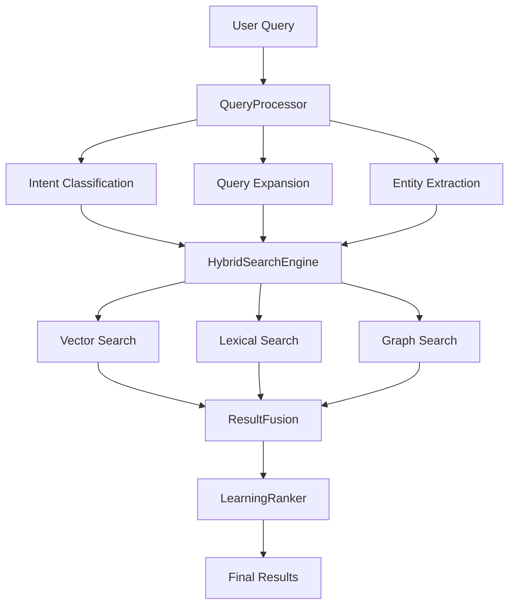
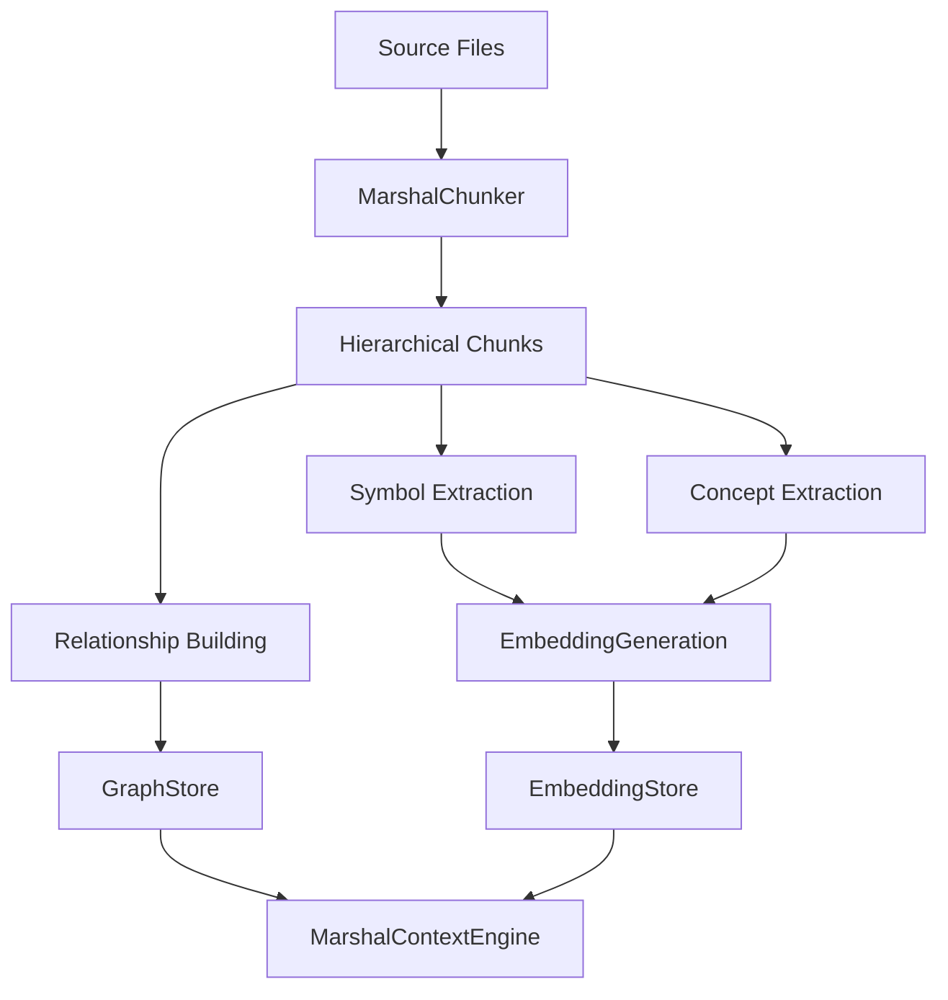

# Marshal Context Engine Architecture

## 🏗️ System Overview

The Marshal Context Engine is designed with superior intent understanding, multi-modal search capabilities, and learning-based ranking. The architecture is built around five core principles:

1. **Multi-Modal Intelligence**: Combines vector, lexical, and graph-based search
2. **Adaptive Learning**: Continuously improves through user feedback and usage patterns
3. **Explainable AI**: Provides clear reasoning for every search result
4. **Massive Scale**: Handles enterprise codebases with millions of lines of code
5. **Real-Time Performance**: Sub-second search with intelligent caching
6. **Absolute Path Support**: Always provides complete file paths for easy navigation in large projects

## 📁 Directory Structure

```
src/
├── core/                    # Core engine components
│   ├── MarshalContextEngine.ts    # Main engine orchestrator
│   ├── QueryProcessor.ts          # Advanced query processing
│   └── ResultFusion.ts           # Multi-modal result fusion
├── intelligence/            # AI/ML components
│   ├── IntentClassifier.ts       # Neural intent classification
│   ├── QueryExpander.ts          # Contextual query expansion
│   ├── LearningRanker.ts         # Adaptive ranking system
│   └── PatternRecognizer.ts      # Code pattern recognition
├── search/                  # Search implementations
│   ├── HybridSearchEngine.ts     # Multi-modal search orchestrator
│   ├── VectorSearch.ts           # Semantic vector search
│   ├── LexicalSearch.ts          # Keyword and symbol search
│   └── GraphSearch.ts            # Relationship-based search
├── graph/                   # Graph analysis
│   ├── CodeGraphBuilder.ts       # Build code relationship graphs
│   ├── RelationshipAnalyzer.ts   # Analyze code dependencies
│   └── DependencyTracker.ts      # Track code dependencies
├── understanding/           # Code comprehension
│   ├── ArchitectureAnalyzer.ts   # High-level architecture analysis
│   ├── ConceptExtractor.ts       # Extract semantic concepts
│   └── PatternMatcher.ts         # Identify code patterns
├── storage/                 # Data management
│   ├── EmbeddingStore.ts         # Efficient embedding storage
│   ├── GraphStore.ts             # Graph data storage
│   └── MetadataStore.ts          # Metadata management
├── utils/                   # Utilities
│   ├── PerformanceMonitor.ts     # Performance tracking
│   ├── CacheManager.ts           # Multi-layer caching
│   ├── QueryUtils.ts             # Query processing utilities
│   └── ConfigManager.ts          # Configuration management
├── chunker/                 # Existing chunking system
├── indexer/                 # Existing indexer components
└── common/                  # Shared types and interfaces
    └── types.ts                  # Enhanced type definitions
```

## 🔄 Data Flow Architecture

### 1. Query Processing Pipeline



### 2. Indexing Pipeline



## 🧠 Core Components

### MarshalContextEngine
The main orchestrator that coordinates all components:
- **Initialization**: Sets up embedding models and data structures
- **Search Coordination**: Manages the multi-phase search process
- **Performance Monitoring**: Tracks and optimizes system performance
- **Learning Integration**: Incorporates user feedback for continuous improvement

### QueryProcessor
Advanced query understanding and preprocessing:
- **Intent Classification**: Uses ML to understand query intent
- **Query Expansion**: Generates semantic variations and related terms
- **Entity Extraction**: Identifies code symbols, functions, and concepts
- **Context Analysis**: Leverages previous queries and user patterns

### HybridSearchEngine
Multi-modal search orchestration:
- **Adaptive Strategy**: Selects optimal search approach based on query
- **Parallel Execution**: Runs multiple search strategies simultaneously
- **Result Aggregation**: Combines results from different search modes
- **Performance Optimization**: Caches and optimizes search operations

### ResultFusion
Intelligent result combination and ranking:
- **Multi-Factor Scoring**: Combines semantic, lexical, and graph scores
- **Explainable Ranking**: Provides clear reasoning for result ordering
- **Diversity Filtering**: Ensures result variety and relevance
- **Confidence Scoring**: Estimates result quality and reliability

### LearningRanker
Adaptive ranking based on user behavior:
- **Feedback Integration**: Learns from user clicks, likes, and interactions
- **Pattern Recognition**: Identifies successful search patterns
- **Personalization**: Adapts to individual user preferences
- **Continuous Improvement**: Updates ranking models in real-time

## 🔍 Search Strategies

### 1. Vector Search
Semantic understanding through embeddings:
- **Dual Models**: Separate code and concept embedding models
- **Contextual Embeddings**: Includes file path, symbols, and metadata
- **Similarity Scoring**: Advanced cosine similarity with intent weighting
- **Semantic Expansion**: Finds conceptually related code

### 2. Lexical Search
Keyword and symbol matching:
- **Inverted Index**: Fast keyword lookup with fuzzy matching
- **Symbol Index**: Dedicated index for code symbols and identifiers
- **N-gram Analysis**: Partial matching and phrase recognition
- **Boost Functions**: Prioritizes exact matches and important symbols

### 3. Graph Search
Relationship-based discovery:
- **Dependency Analysis**: Follows import/export relationships
- **Call Graph Traversal**: Traces function and method calls
- **Inheritance Tracking**: Follows class hierarchies and interfaces
- **Pattern Propagation**: Spreads relevance through code relationships

## 📊 Performance Optimizations

### Multi-Layer Caching
- **Query Cache**: Stores complete search results
- **Embedding Cache**: Caches generated embeddings
- **Index Cache**: Optimizes frequently accessed indices
- **Adaptive Eviction**: Intelligent cache management

### Memory Management
- **Streaming Processing**: Handles large codebases efficiently
- **Lazy Loading**: Loads data on demand
- **Garbage Collection**: Automatic cleanup of unused data
- **Memory Monitoring**: Tracks and optimizes memory usage

### Parallel Processing
- **Concurrent Search**: Runs search strategies in parallel
- **Batch Processing**: Optimizes embedding generation
- **Worker Threads**: Utilizes multiple CPU cores
- **Async Operations**: Non-blocking I/O operations

## 🎯 Key Innovations

### 1. Intent-Aware Search
Unlike traditional keyword search, the Marshal Context Engine understands what users are trying to accomplish:
- **Function Search**: Optimized for finding specific functions or methods
- **Debug Search**: Specialized for error handling and troubleshooting
- **Concept Search**: Focused on understanding and explanation
- **Pattern Search**: Finds similar code patterns and implementations

### 2. Explainable Results
Every search result includes detailed explanations:
- **Ranking Factors**: Shows why each result was selected
- **Confidence Scores**: Indicates result reliability
- **Relationship Context**: Explains how results relate to the query
- **Improvement Suggestions**: Helps users refine their searches

### 3. Continuous Learning
The system improves over time through user interactions:
- **Click-Through Learning**: Learns from user selections
- **Feedback Integration**: Incorporates explicit user feedback
- **Pattern Recognition**: Identifies successful search patterns
- **Adaptive Weights**: Adjusts ranking factors based on effectiveness

### 4. Massive Scale Support
Designed for enterprise codebases with thousands of files and complex directory structures:
- **Absolute Path Resolution**: Always provides complete file paths for precise navigation
- **Horizontal Scaling**: Distributes processing across multiple nodes
- **Incremental Updates**: Only processes changed files
- **Efficient Storage**: Optimized data structures for large datasets
- **Real-Time Sync**: Maintains index consistency during development
- **Directory Traversal**: Robust file discovery that handles deep nested structures
- **Memory Optimization**: Efficient processing of codebases with 1000+ files

## 🔧 Configuration and Customization

### Search Behavior
- **Intent Weights**: Adjust importance of different intent types
- **Search Strategy**: Configure hybrid search behavior
- **Result Limits**: Set maximum results per search type
- **Quality Thresholds**: Define minimum relevance scores

### Performance Tuning
- **Cache Sizes**: Configure memory allocation for caches
- **Batch Sizes**: Optimize embedding generation batches
- **Concurrency**: Set parallel processing limits
- **Timeout Values**: Configure search time limits

### Learning Parameters
- **Learning Rate**: Control adaptation speed
- **Feedback Weights**: Set importance of different feedback types
- **History Retention**: Configure data retention periods
- **Personalization**: Enable/disable user-specific adaptations

## 🔄 Recent Improvements

### Path Handling Enhancements
- **Absolute Path Support**: All search results now show complete absolute paths
- **Directory Traversal Fix**: Fixed critical bug in file discovery for nested directories
- **Large Project Support**: Optimized for codebases with thousands of files and deep folder structures
- **Cross-Platform Compatibility**: Improved path handling for Windows, macOS, and Linux

### Search Quality Improvements
- **Fuzzy Search Enhancement**: Better partial matching and approximate queries
- **Intent Classification**: Improved understanding of user search intent
- **Symbol-Aware Search**: Enhanced detection of functions, classes, and variables
- **Relationship Mapping**: Better understanding of code dependencies and connections

### Performance Optimizations
- **Memory Management**: Reduced memory usage for large codebases
- **Concurrent Processing**: Improved parallel file processing
- **Caching System**: Multi-layer caching for faster subsequent searches
- **Index Efficiency**: Optimized data structures for better search performance

## 🚀 Future Enhancements

### Advanced AI Features
- **Code Generation**: Suggest code completions based on context
- **Refactoring Suggestions**: Identify improvement opportunities
- **Architecture Analysis**: Provide high-level system insights
- **Documentation Generation**: Auto-generate code documentation

### Integration Capabilities
- **IDE Plugins**: Direct integration with popular IDEs
- **CI/CD Integration**: Automated code analysis in pipelines
- **Code Review**: Enhanced code review with contextual insights
- **Team Analytics**: Team-wide coding pattern analysis

### Scalability Improvements
- **Distributed Architecture**: Multi-node deployment support
- **Cloud Integration**: Native cloud platform support
- **Real-Time Collaboration**: Multi-user concurrent access
- **Enterprise Security**: Advanced security and compliance features
