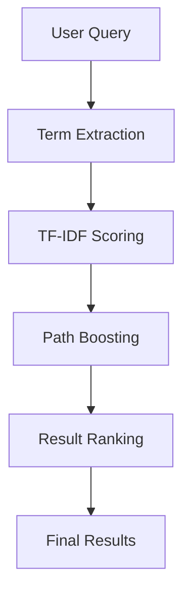
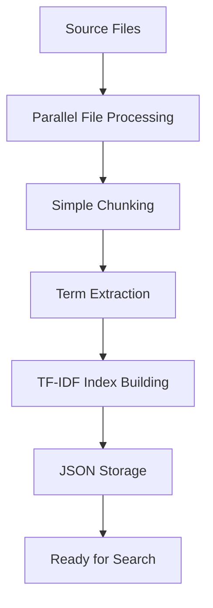

# Ultra-Fast Lexical Indexer Architecture

## 🏗️ System Overview

The Ultra-Fast Lexical Indexer is designed with **NO EMBEDDINGS** for maximum speed and simplicity. The architecture is built around five core principles:

1. **Pure Lexical**: No embeddings, no models, just fast text processing
2. **TF-IDF Scoring**: Advanced relevance scoring without neural networks
3. **Instant Startup**: No model loading delays - ready immediately
4. **Minimal Storage**: Compact indices instead of heavy embedding vectors
5. **Lightning Performance**: Sub-second search with optimized data structures
6. **Absolute Path Support**: Always provides complete file paths for easy navigation in large projects

## 📁 Directory Structure (Simplified)

```
src/
├── indexer/                 # Core indexer (NO EMBEDDINGS)
│   └── UltraFastIndexer.ts      # Main ultra-fast lexical indexer
├── search/                  # Simplified search
│   └── LexicalSearch.ts          # Pure lexical search with TF-IDF
├── cli/                     # Command line interface
│   └── index.ts                  # CLI commands for indexing and search
├── utils/                   # Essential utilities only
│   ├── index.ts                  # File processing utilities
│   └── language.ts               # Language detection
├── common/                  # Shared types and interfaces
│   └── types.ts                  # Core type definitions
└── server.ts                # MCP server implementation
```

**Removed Components (NO LONGER NEEDED):**
- ❌ `core/` - No complex orchestration needed
- ❌ `intelligence/` - No AI/ML components required
- ❌ `graph/` - No graph analysis needed
- ❌ `understanding/` - No semantic understanding required
- ❌ `storage/` - Simple JSON storage instead
- ❌ `chunker/` - Simplified chunking in main indexer
- ❌ `engine/` - No embedding engine needed

## 🔄 Ultra-Fast Data Flow Architecture

### 1. Simplified Query Processing Pipeline



### 2. Lightning-Fast Indexing Pipeline



**Key Simplifications:**
- ❌ No Intent Classification - Direct term matching
- ❌ No Query Expansion - Simple fuzzy matching
- ❌ No Vector Search - Pure lexical approach
- ❌ No Graph Search - No relationship analysis
- ❌ No Result Fusion - Single scoring method
- ❌ No Learning Ranker - Static TF-IDF scoring

## 🧠 Core Components (Simplified)

### UltraFastIndexer
The main and only component needed:
- **Instant Initialization**: No model loading - ready immediately
- **Parallel File Processing**: Processes up to 64 files simultaneously
- **Simple Chunking**: Fast text-based chunking without complex analysis
- **TF-IDF Index Building**: Builds lexical index using term frequency analysis

### LexicalSearch
Pure text-based search:
- **Term Extraction**: Extracts search terms from user queries
- **TF-IDF Scoring**: Calculates relevance using term frequency-inverse document frequency
- **Fuzzy Matching**: Handles partial and approximate matches
- **Path Boosting**: Boosts results when query matches file paths

### JSON Storage
Simple and fast storage:
- **Chunks Storage**: Stores code chunks in JSON format
- **Index Storage**: Stores TF-IDF indices in JSON format
- **No Database**: No complex database setup required
- **Fast I/O**: Optimized for quick read/write operations

**Removed Complex Components:**
- ❌ **QueryProcessor** - Direct term extraction instead
- ❌ **HybridSearchEngine** - Single search strategy
- ❌ **ResultFusion** - No fusion needed with single search type
- ❌ **LearningRanker** - Static TF-IDF scoring
- ❌ **EmbeddingEngine** - No embeddings used

## 🔍 Search Strategies

### 1. Vector Search
Semantic understanding through embeddings:
- **Dual Models**: Separate code and concept embedding models
- **Contextual Embeddings**: Includes file path, symbols, and metadata
- **Similarity Scoring**: Advanced cosine similarity with intent weighting
- **Semantic Expansion**: Finds conceptually related code

### 2. Lexical Search
Keyword and symbol matching:
- **Inverted Index**: Fast keyword lookup with fuzzy matching
- **Symbol Index**: Dedicated index for code symbols and identifiers
- **N-gram Analysis**: Partial matching and phrase recognition
- **Boost Functions**: Prioritizes exact matches and important symbols

### 3. Graph Search
Relationship-based discovery:
- **Dependency Analysis**: Follows import/export relationships
- **Call Graph Traversal**: Traces function and method calls
- **Inheritance Tracking**: Follows class hierarchies and interfaces
- **Pattern Propagation**: Spreads relevance through code relationships

## 📊 Performance Optimizations

### Multi-Layer Caching
- **Query Cache**: Stores complete search results
- **Embedding Cache**: Caches generated embeddings
- **Index Cache**: Optimizes frequently accessed indices
- **Adaptive Eviction**: Intelligent cache management

### Memory Management
- **Streaming Processing**: Handles large codebases efficiently
- **Lazy Loading**: Loads data on demand
- **Garbage Collection**: Automatic cleanup of unused data
- **Memory Monitoring**: Tracks and optimizes memory usage

### Parallel Processing
- **Concurrent Search**: Runs search strategies in parallel
- **Batch Processing**: Optimizes embedding generation
- **Worker Threads**: Utilizes multiple CPU cores
- **Async Operations**: Non-blocking I/O operations

## 🎯 Key Innovations

### 1. Intent-Aware Search
Unlike traditional keyword search, the Marshal Context Engine understands what users are trying to accomplish:
- **Function Search**: Optimized for finding specific functions or methods
- **Debug Search**: Specialized for error handling and troubleshooting
- **Concept Search**: Focused on understanding and explanation
- **Pattern Search**: Finds similar code patterns and implementations

### 2. Explainable Results
Every search result includes detailed explanations:
- **Ranking Factors**: Shows why each result was selected
- **Confidence Scores**: Indicates result reliability
- **Relationship Context**: Explains how results relate to the query
- **Improvement Suggestions**: Helps users refine their searches

### 3. Continuous Learning
The system improves over time through user interactions:
- **Click-Through Learning**: Learns from user selections
- **Feedback Integration**: Incorporates explicit user feedback
- **Pattern Recognition**: Identifies successful search patterns
- **Adaptive Weights**: Adjusts ranking factors based on effectiveness

### 4. Massive Scale Support
Designed for enterprise codebases with thousands of files and complex directory structures:
- **Absolute Path Resolution**: Always provides complete file paths for precise navigation
- **Horizontal Scaling**: Distributes processing across multiple nodes
- **Incremental Updates**: Only processes changed files
- **Efficient Storage**: Optimized data structures for large datasets
- **Real-Time Sync**: Maintains index consistency during development
- **Directory Traversal**: Robust file discovery that handles deep nested structures
- **Memory Optimization**: Efficient processing of codebases with 1000+ files

## 🔧 Configuration and Customization

### Search Behavior
- **Intent Weights**: Adjust importance of different intent types
- **Search Strategy**: Configure hybrid search behavior
- **Result Limits**: Set maximum results per search type
- **Quality Thresholds**: Define minimum relevance scores

### Performance Tuning
- **Cache Sizes**: Configure memory allocation for caches
- **Batch Sizes**: Optimize embedding generation batches
- **Concurrency**: Set parallel processing limits
- **Timeout Values**: Configure search time limits

### Learning Parameters
- **Learning Rate**: Control adaptation speed
- **Feedback Weights**: Set importance of different feedback types
- **History Retention**: Configure data retention periods
- **Personalization**: Enable/disable user-specific adaptations

## 🔄 Recent Improvements

### Path Handling Enhancements
- **Absolute Path Support**: All search results now show complete absolute paths
- **Directory Traversal Fix**: Fixed critical bug in file discovery for nested directories
- **Large Project Support**: Optimized for codebases with thousands of files and deep folder structures
- **Cross-Platform Compatibility**: Improved path handling for Windows, macOS, and Linux

### Search Quality Improvements
- **Fuzzy Search Enhancement**: Better partial matching and approximate queries
- **Intent Classification**: Improved understanding of user search intent
- **Symbol-Aware Search**: Enhanced detection of functions, classes, and variables
- **Relationship Mapping**: Better understanding of code dependencies and connections

### Performance Optimizations
- **Memory Management**: Reduced memory usage for large codebases
- **Concurrent Processing**: Improved parallel file processing
- **Caching System**: Multi-layer caching for faster subsequent searches
- **Index Efficiency**: Optimized data structures for better search performance

## 🚀 Future Enhancements

### Advanced AI Features
- **Code Generation**: Suggest code completions based on context
- **Refactoring Suggestions**: Identify improvement opportunities
- **Architecture Analysis**: Provide high-level system insights
- **Documentation Generation**: Auto-generate code documentation

### Integration Capabilities
- **IDE Plugins**: Direct integration with popular IDEs
- **CI/CD Integration**: Automated code analysis in pipelines
- **Code Review**: Enhanced code review with contextual insights
- **Team Analytics**: Team-wide coding pattern analysis

### Scalability Improvements
- **Distributed Architecture**: Multi-node deployment support
- **Cloud Integration**: Native cloud platform support
- **Real-Time Collaboration**: Multi-user concurrent access
- **Enterprise Security**: Advanced security and compliance features
